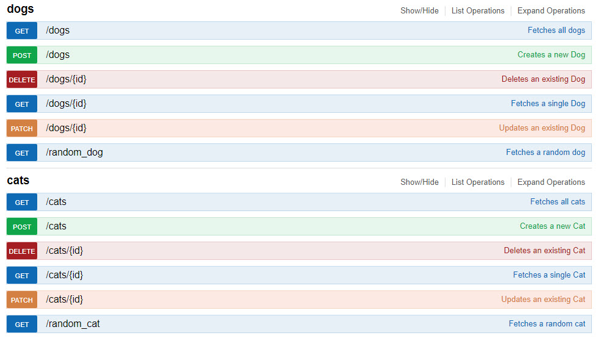
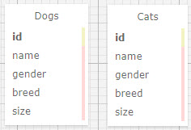
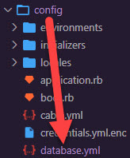

# Animal Shelter API
#### **Author: Zack Rutledge**
* * *

## Description

An Animal Shelter API that includes a list of Cats and Dogs available for adoption.

## Technologies used

* Bootstrap
* Bundler
* FactoryBot
* Faker
* git
* HTML
* PostgreSQL
* Rspec
* Ruby on Rails
* Swagger-Docs

* * *

## Authentication

This service requires no authentication to use.

## Demo API

To Demo this API, follow the installation instructions listed below and navigate to http://localhost:3000/index.html in your browser. \
There you can live demo the following API calls:

**_Note: To search cat by name, gender, breed, or size, search params must be lowercase_**

**Table of Search Options**
 Action |  Route | Description
| :--- | --- | ---: |
| <span style="color:dodgerblue">Get</span> | /cats?name={name} | _Fetches cats that match a name_ |
| <span style="color:dodgerblue">Get</span> | /cats?gender={gender} | _Fetches cats that match a gender_ |
| <span style="color:dodgerblue">Get</span> | /cats?breed={breed} | _Fetches cats that match a breed_ |
| <span style="color:dodgerblue">Get</span> | /cats?size={size} | _Fetches cats that match a size_ |
| <span style="color:dodgerblue">Get</span> | /dogs?name={name} | _Fetches dogs that match a name_ |
| <span style="color:dodgerblue">Get</span> | /dogs?gender={gender} | _Fetches dogs that match a gender_ |
| <span style="color:dodgerblue">Get</span> | /dogs?breed={breed} | _Fetches dogs that match a breed_ |
| <span style="color:dodgerblue">Get</span> | /dogs?size={size} | _Fetches dogs that match a size_ |

**Preview List of available Routes**<br>


## Responses & Errors

* 404 - Not Found \
  **{ "message": "Couldn't find cat with 'id'=  " }**
* 422 - Unprocessable Entity \
  **{ "message": "Validation failed" }**
* 500 - Internal Server Error \
  **{ "error": "Internal Server Error" }**

* * *
## Schema


* * *
## Software Requirements
* **Ruby is required to run this application**
* **PostgreSQL is required to run the database**

  <a href="https://www.learnhowtoprogram.com/ruby-and-rails/getting-started-with-ruby/installing-ruby">Ruby download instructions</a>
  <a href="https://www.learnhowtoprogram.com/ruby-and-rails/getting-started-with-ruby/installing-postgres">PostgreSQL download instructions</a>

## Installation Instructions
1. Navigate to the desired directory where you would like to clone the project to.

2. Once you have chosen your desired directory, clone the github repo using the version control tool `git` (<a href="https://www.learnhowtoprogram.com/introduction-to-programming/getting-started-with-intro-to-programming/git-and-github">download instructions</a>). Typing the following command into your terminal:
```bash
$ git clone https://github.com/andyL89/travel_api.git
```
3. Open the project in VSCode by typing the following in your terminal:

``` bash
$ code .
```
* Note: VSCode is a code editing software. If you don't already have it, you can download it <a href="https://code.visualstudio.com/">here</a>

4. While located in the root directy, install gem bundler by typing:

``` bash
$ gem install bundler
```

5. Install gem bundles by typing:

``` bash
$ bundle install
```

6. **IF A WINDOWS USER** - Add your PSQL Username and Password to the database.yml file located within the config folder!
<br>


7. Create a database for this project by typing the following into your terminal while located in the root directory:
```
$ rake db:setup
```

8. Seed the database with supplementary data:
```
$ rake db:seed
```

9. Prepare API documentation to view in browser:
```
$ rake swagger:docs
```

The database should now be correctly set up. And you may start a local server to interact with the project.

10. To start a local server, open your default browser and type "localhost:3000" into the search bar and press enter. Here, you will see the live server.

## Running Tests
* This application was created using test-driven development (TDD).
* To run the tests yourself, follow the steps below.

Simply type "rspec" into your terminal while located in the root directory of the project.
``` bash
$ rspec
```
* * *

## License
> [GPLv3](https://choosealicense.com/licenses/gpl-3.0/)\
> Zack Rutledge &copy; 2021

* * *

## Contact Information

Reach Zack via <a href="https://www.linkedin.com/in/zack-rutledge762/" target="_blank">Linkedin</a> or <a href="thorgrim88@gmail.com" target="_blank">email</a></li>.